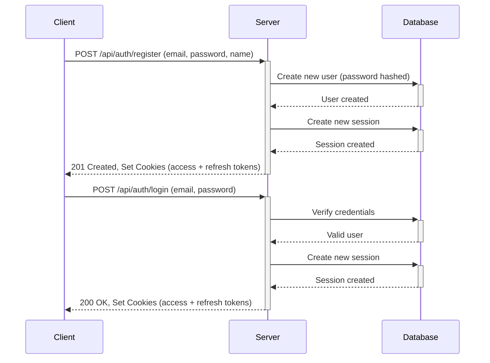
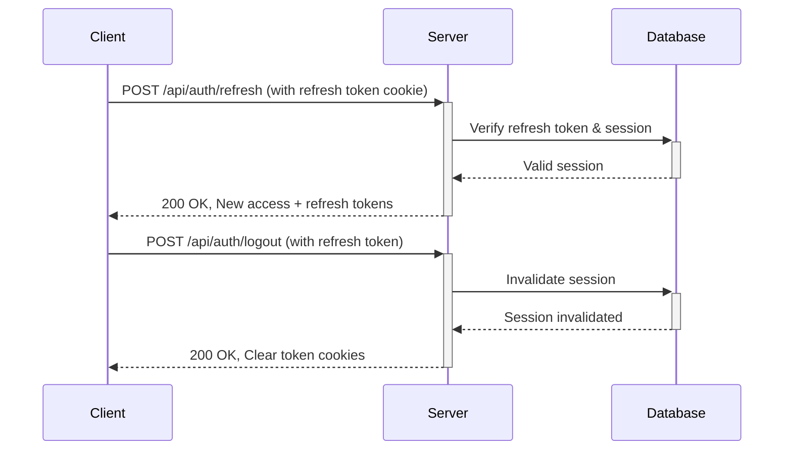

# Express TypeScript Starter with Auth & CRUD

A production-ready RESTful API starter template built with Express, TypeScript, and Prisma. Features robust authentication with JWT tokens, session management, and CRUD operations for users and blog posts.


## Authentication Flow

### Registration & Login



### Token Refresh & Logout




## Features

### Core Technologies

- **TypeScript** for type safety and better developer experience
- **Express.js** for HTTP server and routing
- **Prisma ORM** with SQLite (easily switchable to PostgreSQL, MySQL, etc.)
- **JWT Authentication** with access and refresh tokens
- **Cookie-based Auth** using HTTP-only cookies for enhanced security

### Authentication & Security

- Stateful sessions with refresh tokens
- HTTP-only cookies for token storage
- Password hashing with bcrypt
- CORS protection configured
- Multiple session management (login from multiple devices)
- Session revocation capabilities

### API Features

- Complete user management (register, login, update, delete)
- Blog post CRUD operations with author verification
- Input validation using Zod schemas
- Proper error handling and status codes
- RESTful endpoints following best practices

### Developer Experience

- Well-organized project structure
- Validation middleware with Zod
- Auth middleware for protected routes
- Environment variables configuration
- Morgan logging for API requests

## API Documentation

### Authentication Endpoints

| Method | Endpoint             | Description                   | Auth Required |
| ------ | -------------------- | ----------------------------- | ------------- |
| `POST` | `/api/auth/register` | Register a new user           | No            |
| `POST` | `/api/auth/login`    | Login and receive auth tokens | No            |
| `POST` | `/api/auth/refresh`  | Refresh access token          | No\*          |
| `POST` | `/api/auth/logout`   | Invalidate current session    | Yes           |

\* Requires a valid refresh token cookie

### Session Management

| Method   | Endpoint                   | Description                           | Auth Required |
| -------- | -------------------------- | ------------------------------------- | ------------- |
| `GET`    | `/api/sessions`            | List all active sessions              | Yes           |
| `DELETE` | `/api/sessions/:sessionId` | Terminate a specific session          | Yes           |
| `DELETE` | `/api/sessions`            | Terminate all sessions except current | Yes           |

### User Operations

| Method   | Endpoint         | Description                 | Auth Required |
| -------- | ---------------- | --------------------------- | ------------- |
| `GET`    | `/api/users`     | List all users (admin only) | Yes           |
| `GET`    | `/api/users/:id` | Get user details            | Yes           |
| `GET`    | `/api/profile`   | Get current user profile    | Yes           |
| `PUT`    | `/api/users/:id` | Update user information     | Yes           |
| `DELETE` | `/api/users/:id` | Delete a user               | Yes           |

### Blog Operations

| Method   | Endpoint         | Description            | Auth Required |
| -------- | ---------------- | ---------------------- | ------------- |
| `GET`    | `/api/blogs`     | Get all blog posts     | No            |
| `GET`    | `/api/blogs/:id` | Get a specific blog    | No            |
| `POST`   | `/api/blogs`     | Create a new blog post | Yes           |
| `PUT`    | `/api/blogs/:id` | Update a blog post     | Yes\*         |
| `DELETE` | `/api/blogs/:id` | Delete a blog post     | Yes\*         |

\* Requires author permission (user must be the creator of the blog post)

## Project Architecture

### Directory Structure

```bash
src/
├── config/              # Configuration files and environment variables
│   └── auth.config.ts   # Authentication configuration
├── controllers/         # API endpoint handlers
│   ├── auth.controller.ts
│   ├── blog.controller.ts
│   ├── session.controller.ts
│   └── user.controller.ts
├── middlewares/         # Express middlewares
│   ├── auth.middleware.ts    # Token validation & user authentication
│   ├── blog.middleware.ts    # Blog ownership verification
│   ├── session.middleware.ts # Session validation
│   └── validation.middleware.ts # Request data validation
├── routes/              # API route definitions
│   ├── auth.ts          # Authentication routes
│   ├── blog.ts          # Blog CRUD routes
│   ├── session.ts       # Session management routes
│   └── user.ts          # User management routes
├── utils/               # Helper functions
│   ├── auth.ts          # Token generation & verification
│   └── session.ts       # Session management utilities
├── validation/          # Zod validation schemas
│   ├── auth.schema.ts   # Auth input validation
│   ├── blog.schema.ts   # Blog input validation
│   └── user.schema.ts   # User input validation
├── types/               # TypeScript type definitions
├── prisma.ts            # Prisma client initialization
├── server.ts            # Entry point
└── app.ts               # Express app configuration
```

### Key Files Explained

- **app.ts**: Configures Express middleware (CORS, body parsing, cookies), sets up routes
- **prisma.ts**: Initializes and exports the Prisma client for database operations
- **auth.controller.ts**: Handles user registration, login, token refresh, and logout
- **auth.middleware.ts**: Validates JWT tokens and extracts user information
- **validation.middleware.ts**: Generic middleware that validates requests using Zod schemas

## Getting Started

### Prerequisites

- Node.js (v16+)
- npm or yarn

### Installation Steps

1. Clone this repository:

   ```bash
   git clone https://github.com/yourusername/express-server.git
   cd express-server
   ```

2. Install dependencies:

   ```bash
   npm install
   ```

3. Create a `.env` file in the root directory:

   ```env
   DATABASE_URL="file:./prisma/dev.db"
   PORT=4000
   JWT_SECRET="your_jwt_secret_here"
   JWT_SECRET_EXPIRES_IN="15m"
   JWT_REFRESH_SECRET="your_refresh_token_secret_here"
   JWT_REFRESH_SECRET_EXPIRES_IN="30d"
   FRONTEND_URL="http://localhost:3000"
   ```

4. Initialize the database:

   ```bash
   npx prisma migrate dev --name init
   ```

5. Start the development server:

   ```bash
   npm run dev
   ```

6. For production builds:

   ```bash
   npm run build
   npm start
   ```

## Security Features

This template implements multiple security best practices:

- **HTTP-only Cookies**: Access and refresh tokens stored in HTTP-only cookies prevent XSS attacks
- **CORS Protection**: Configured to restrict access from unauthorized origins
- **Password Security**: Passwords are hashed using bcrypt before storage
- **JWT Authentication**: Short-lived access tokens (15 minutes) and longer-lived refresh tokens (30 days)
- **Session Management**: Users can view and revoke active sessions
- **Token Refresh**: Secure token refresh process without re-authentication
- **Permission Checks**: Users can only modify their own resources (blogs/sessions)

## Data Models

### User Model

```prisma
model User {
  id        Int       @id @default(autoincrement())
  name      String
  email     String    @unique
  password  String
  createdAt DateTime  @default(now())
  updatedAt DateTime  @updatedAt
  blogs     Blog[]
  sessions  Session[]
}
```

### Session Model

```prisma
model Session {
  id           String   @id @default(cuid())
  userId       Int
  user         User     @relation(fields: [userId], references: [id], onDelete: Cascade)
  refreshToken String   @unique
  isValid      Boolean  @default(true)
  userAgent    String?
  ipAddress    String?
  createdAt    DateTime @default(now())
  updatedAt    DateTime @updatedAt
}
```

### Blog Model

```prisma
model Blog {
  id        Int      @id @default(autoincrement())
  title     String
  content   String
  published Boolean  @default(false)
  authorId  Int
  author    User     @relation(fields: [authorId], references: [id], onDelete: Cascade)
  createdAt DateTime @default(now())
  updatedAt DateTime @updatedAt
}
```

## Customization

### Adding New Models

1. Update `prisma/schema.prisma` with your model
2. Generate Prisma client: `npx prisma generate`
3. Create migration: `npx prisma migrate dev --name add_model`
4. Create controller, routes, and validation schema

### Authentication Configuration

Modify token expiration and cookie settings in:

- `src/config/auth.config.ts`
- `src/controllers/auth.controller.ts` (cookie settings)

## License

MIT License - Feel free to use and modify for your projects.

## Contributing

Contributions, issues, and feature requests are welcome!
